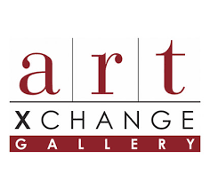
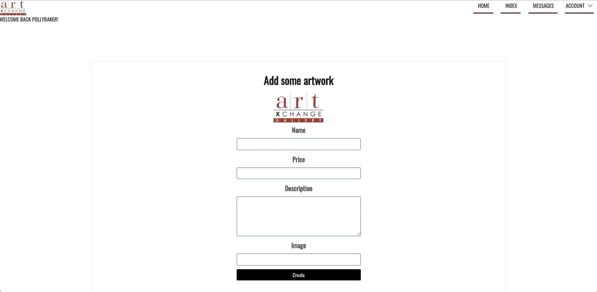
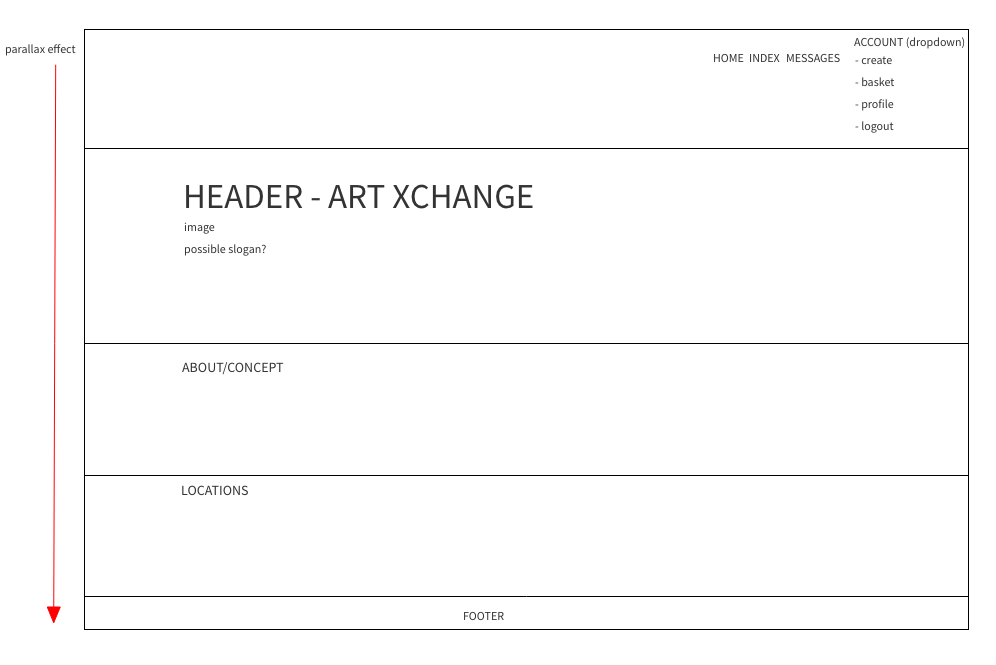
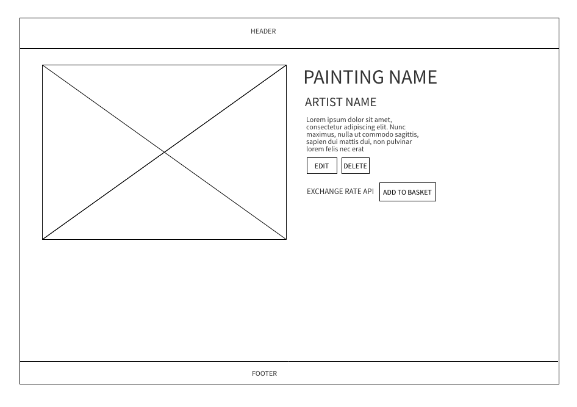
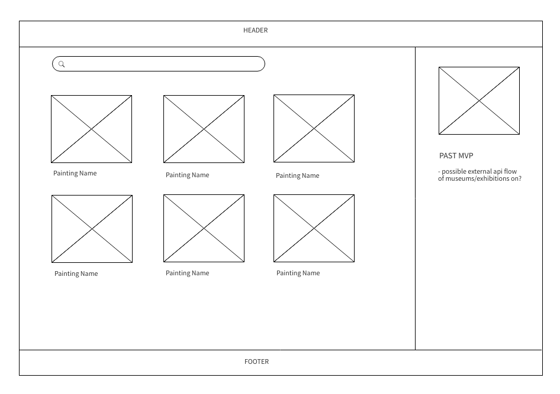
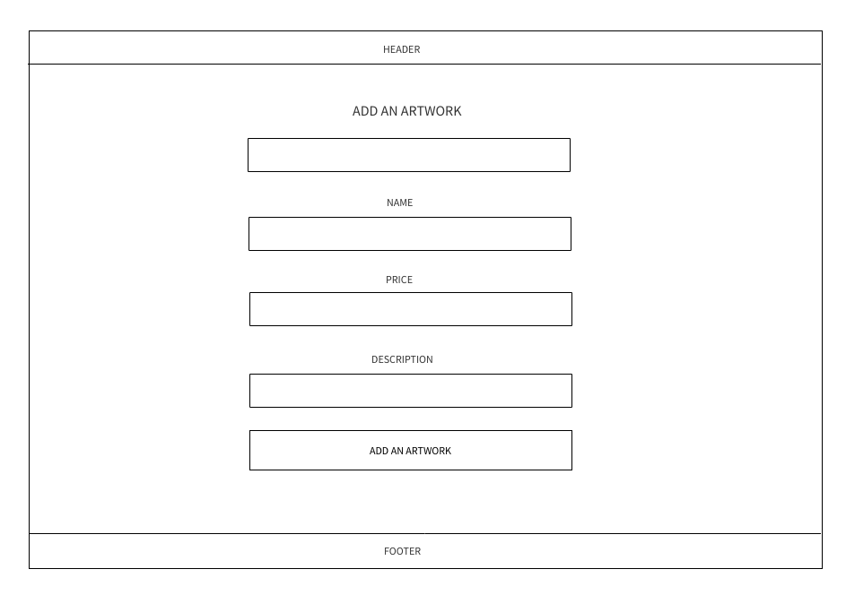

# **Project 4: Art Xchange** 

## Background
Art Xchange is an E-commerce platform that connects buyers and sellers of affordable art.

Launch on [Heroku](https://artxchange.herokuapp.com/) or check out the GitHub [Repo](https://github.com/zoebarrington/wdi-project-four).

### Course Curriculum
**Week 10-11** | Module Four  
* React
* JSX
* ES6

*Full curriculum available at the bottom of the page*

***

## Project Brief

Your app must:
- Use Mongo, Express and Node to build an API and a React front-end app that consumes it
- Create an API using at least 2 related models, one of which should be a user
- Be  complete product
- Implement thoughtful user stories/wireframes
- Be deployed online so it's publicly accessible
- Have automated tests for at lest one RESTful resource on the back-end, and at least one classical and functional component on the front-end
- A link to your hosted working app in the URL section of your Github repo
- A readme.md file
- Layout and style your front-end with clean and well-formatted CSS

**Timeframe:** 1 week(December 2018)

## Concept
Users can use Art Xchange as a platform to buy and sell art at an affordable price, making art accessible to everyone.

## Home Page  


## Index Page  


## Create Page  


## Show Page


## Profile Page  


## Messaging


## Features
All Features  
> All users are able to:
* Home Page
* Artwork index and show page
* Register
* Edit and delete artworks
* Use the Exchange Rate function to see the price in chosen currency  

> Registered users are able to:
* Log in and log out
* Message other users
* Have a profile page which displays all of their uploaded artworks
* Follow other users
* Put artworks in their basket
* See an overview of their basket items

## Technologies Used
- HTML 5
- SCSS
- JavaScript(ECMAScript 6)
- axios: v0.18.0
- react: v16.4.2
- react-router-dom: v4.3.1
- Node.js
- MongoDB
- bcypt: v3.0.0
- bluebird: v3.5.1
- body-parser: v1.18.3
- express: v4.16.3
- jsonwebtoken: v8.3.0
- mongoose: v5.2.10
- mongoose-unique-validator: v2.0.1
- morgan: v1.9.0
- request-promise: v4.2.2
- chai: v4.1.2
- mocha: v5.2.0
- GitHub
- Github
- Heroku  
- Trello
- Photoshop
- Google Fonts  
- Fontawesome

## APIs Used
- Exchange Rate API

## Wireframes

### Home Page  


### Show Page  


### Index Page


### Create Page  


## Featured Piece of Code no.1

## Featured Piece of Code no.2
```javascript
<div className="basket-section">
  <div>
    <form onSubmit={calculateTotal}>
      <select id="select" name="currency" onChange={handleChange}>
        {currency && Object.keys(currency.rates).map( options =>
          <option value={options} key={options}>{options}</option>)}
      </select>
    </form>
  </div>

  <p id="price">{selectedCurrency === 'GBP' ? '£' : `${selectedCurrency} `}{totalPrice}</p>
  <button className="basket-button" onClick={handleClick}>Add to basket</button>
</div>
</div>
```

## Challenges Faced

## Wins

- My greatest win in this project was managed to get the external exchange rate API to work. It took a lot of conceptual planning, and I felt it was my greatest achievement within the project.

- I am proud of all the functionality that I have produced, as well as the styling.

## Future Features
* Make create and delete features only available to logged in users  
* Users can see a list of followers and users they are following  

***

## Course Curriculum

> **Week 1-3** | Module One  
* HTML5
* CSS3 and CSS Animation
* Sass
* JavaScript
* jQuery

> **Week 4** | Project One

> **Week 5** | Module Two  
* Node.js
* Express.js
* EJS
* MongoDB
* User Authentication  

> **Week 6** | Project Two

> **Week 7-8** | Module Three
* AngularJS
* Token Authentication & Session Authentication
* Third-party APIs
* Mocha and Chai

> **Week 9** | Project Three

> **Week 10-11** | Module Four
* React
* JSX
* ES6

>**Week 12** | Project Four

***
## Contact
### Zoe Barrington  
Email: zlfbarrington@gmail.com

[Porfolio](zoebarrington.com) | [LinkedIn](https://www.linkedin.com/notifications/) | [GitHub](https://github.com/zoebarrington)
